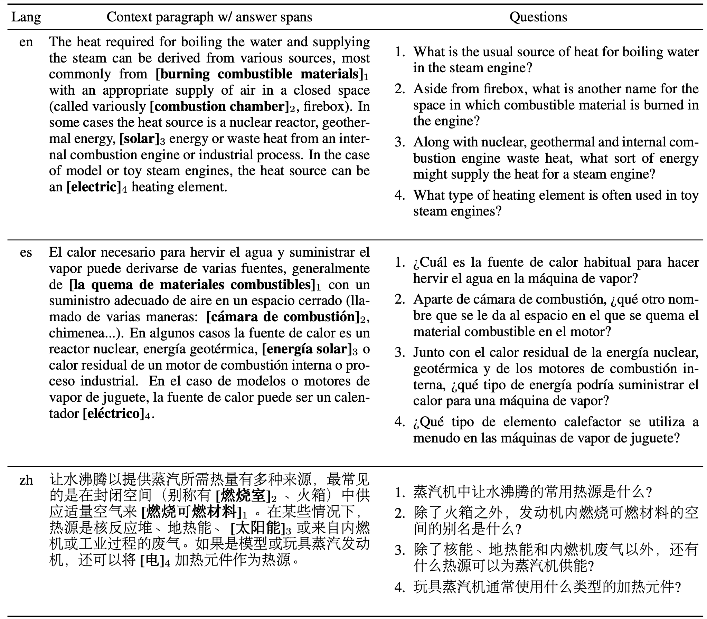

# XQuAD

XQuAD (Cross-lingual Question Answering Dataset) is a benchmark dataset for evaluating cross-lingual question answering performance.
The dataset consists of a subset of 240 paragraphs and 1190 question-answer pairs from
the development set of SQuAD v1.1 [(Rajpurkar et al., 2016)](https://www.aclweb.org/anthology/D16-1264/) together with their professional
translations into ten languages: Spanish, German, Greek, Russian, Turkish, Arabic, Vietnamese, Thai, Chinese, and Hindi.
Consequently, the dataset is _entirely parallel_ across 11 languages.

For more information on how the dataset was created, refer to our paper,
[On the Cross-lingual Transferability of Monolingual Representations](https://arxiv.org/abs/1910.11856).

All files are in json format following the SQuAD dataset format. A parallel example in XQuAD in
English, Spanish, and Chinese can be seen in the image below. The full dataset consists of 240
such parallel instances in 11 languages.

__Update__: Added SQuAD v1.1 professionally translated to Romanian.



## Data

This directory contains files in the following languages:
- Arabic: `xquad.ar.json`
- German: `xquad.de.json`
- Greek: `xquad.el.json`
- English: `xquad.en.json`
- Spanish: `xquad.es.json`
- Hindi: `xquad.hi.json`
- Russian: `xquad.ru.json`
- Thai: `xquad.th.json`
- Turkish: `xquad.tr.json`
- Vietnamese: `xquad.vi.json`
- Chinese: `xquad.zh.json`
- Romanian: `xquad.ro.json` (newly added; not included in the original XQuAD)

As the dataset is based on SQuAD v1.1, there are no unanswerable questions in the data. We chose this
setting so that models can focus on cross-lingual transfer.

We show the average number of tokens per paragraph, question, and answer for each language in the
table below. The statistics were obtained using [Jieba](https://github.com/fxsjy/jieba) for Chinese
and the [Moses tokenizer](https://github.com/moses-smt/mosesdecoder/blob/master/scripts/tokenizer/tokenizer.perl)
for the other languages. 

|           |   en  |   es  |   de  |   el  |   ru  |   tr  |   ar  |   vi  |   th  |   zh  |   hi  |
|-----------|:-----:|:-----:|:-----:|:-----:|:-----:|:-----:|:-----:|:-----:|:-----:|:-----:|:-----:|
| Paragraph | 142.4 | 160.7 | 139.5 | 149.6 | 133.9 | 126.5 | 128.2 | 191.2 | 158.7 | 147.6 | 232.4 |
| Question  |  11.5 |  13.4 |  11.0 |  11.7 |  10.0 |  9.8  |  10.7 |  14.8 |  11.5 |  10.5 |  18.7 |
| Answer    |  3.1  |  3.6  |  3.0  |  3.3  |  3.1  |  3.1  |  3.1  |  4.5  |  4.1  |  3.5  |  5.6  |

## Training and evaluation

In order to evaluate on XQuAD, models should be trained on the SQuAD v1.1 training file. which can be
downloaded from [here](https://github.com/rajpurkar/SQuAD-explorer/blob/master/dataset/train-v1.1.json). 
Model validation similarly should be conducted on the SQuAD v1.1 validation file.

For evaluation, we use the official SQuAD `evaluate-v1.1.py` script, which can be obtained from
[here](https://raw.githubusercontent.com/allenai/bi-att-flow/master/squad/evaluate-v1.1.py). Note that 
the SQuAD evaluation script normalises the answer based on heuristics that are specific to English.
We have observed language-specific normalisation heuristics only to have a marginal impact on performance,
which is why we use the English SQuAD v1.1 evaluation script for convenience.

## Baselines

We show results using baseline methods in the tables below. We directly fine-tune [mBERT](https://github.com/google-research/bert/blob/master/multilingual.md)
and [XLM-R Large](https://arxiv.org/abs/1911.02116) on the English SQuAD v1.1 training data
and evaluate them via zero-shot transfer on the XQuAD test datasets. For translate-train, 
we fine-tune mBERT on the SQuAD v1.1 training data, which we automatically translate
to the target language. For translate-test, we fine-tune [BERT-Large](https://arxiv.org/abs/1810.04805)
on the SQuAD v1.1 training set and evaluate it on the XQuAD test set of the target language,
which we automatically translate to English. Note that results with translate-test are not directly
comparable as we drop a small number (less than 3%) of the test examples.

F1 scores:

| Model                 | en   | ar   | de   | el   | es   | hi   | ru   | th   | tr   | vi   | zh   | ro   | avg  |
|-----------------------|------|------|------|------|------|------|------|------|------|------|------|------|------|
| mBERT                 | 83.5 | 61.5 | 70.6 | 62.6 | 75.5 | 59.2 | 71.3 | 42.7 | 55.4 | 69.5 | 58.0 | 72.7 | 65.2 |
| XLM-R Large           | 86.5 | 68.6 | 80.4 | 79.8 | 82.0 | 76.7 | 80.1 | 74.2 | 75.9 | 79.1 | 59.3 | 83.6 | 77.2 |
| Translate-train mBERT | 83.5 | 68.0 | 75.6 | 70.0 | 80.2 | 69.6 | 75.0 | 36.9 | 68.9 | 75.6 | 66.2 | -    | 70.0 |
| Translate-test BERT-L | 87.9 | 73.7 | 79.8 | 79.4 | 82.0 | 74.9 | 79.9 | 64.6 | 67.4 | 76.3 | 73.7 | -    | 76.3 |

EM scores:

| Model                 | en   | ar   | de   | el   | es   | hi   | ru   | th   | tr   | vi   | zh   | ro   | avg  |
|-----------------------|------|------|------|------|------|------|------|------|------|------|------|------|------|
| mBERT                 | 72.2 | 45.1 | 54.0 | 44.9 | 56.9 | 46.0 | 53.3 | 33.5 | 40.1 | 49.6 | 48.3 | 59.9 | 50.3 |
| XLM-R Large           | 75.7 | 49.0 | 63.4 | 61.7 | 63.9 | 59.7 | 64.3 | 62.8 | 59.3 | 59.0 | 50.0 | 69.7 | 61.5 |
| Translate-train mBERT | 72.2 | 51.1 | 60.7 | 53.0 | 63.1 | 55.4 | 59.7 | 33.5 | 54.8 | 56.2 | 56.6 | -    | 56.0 |
| Translate-test BERT-L | 77.1 | 58.8 | 66.7 | 65.5 | 68.4 | 60.1 | 66.7 | 50.0 | 49.6 | 61.5 | 59.1 | -    | 62.1 |

## Best practices

XQuAD is intended as an evaluation corpus for _zero-shot_ cross-lingual transfer.
Evaluation on the test data should ideally only be conducted at the very end of
the experimentation in order to avoid overfitting to the data.

If you are evaluating on XQuAD in the zero-shot setting, please state explicitly 
your experimental settings, particularly what monolingual and cross-lingual data 
you used for pre-training and fine-tuning your model.

## Reference

If you use this dataset, please cite [[1]](https://arxiv.org/abs/1910.11856):

[1] Artetxe, M., Ruder, S., & Yogatama, D. (2019). [On the cross-lingual transferability of monolingual representations](https://arxiv.org/abs/1910.11856). arXiv preprint arXiv:1910.11856.

```
@article{Artetxe:etal:2019,
      author    = {Mikel Artetxe and Sebastian Ruder and Dani Yogatama},
      title     = {On the cross-lingual transferability of monolingual representations},
      journal   = {CoRR},
      volume    = {abs/1910.11856},
      year      = {2019},
      archivePrefix = {arXiv},
      eprint    = {1910.11856}
}
```

The Romanian version of this data is part of [LiRo](https://eemlcommunity.github.io/ro_benchmark_leaderboard/), a benchmark for Romanian natural language understanding tasks. This page will be updated with a reference.

## License

This dataset is distributed under the [CC BY-SA 4.0 license](https://creativecommons.org/licenses/by-sa/4.0/legalcode).

This is not an officially supported Google product.
